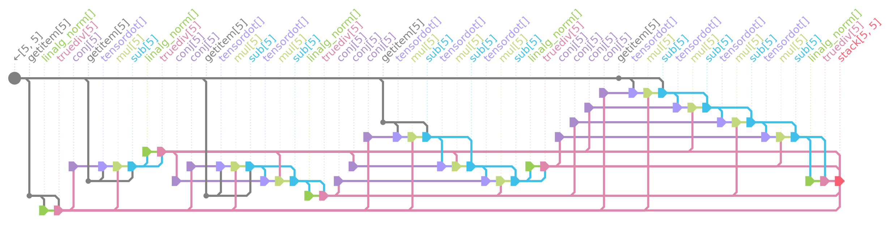
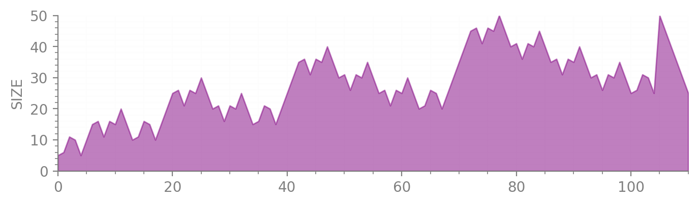

<p align="left"></p>

A lightweight python AUTOmatic-arRAY library. Write numeric code that works for:

* [numpy](https://github.com/numpy/numpy)
* [pytorch](https://pytorch.org/)
* [jax](https://github.com/google/jax)
* [cupy](https://github.com/cupy/cupy)
* [dask](https://github.com/dask/dask)
* [autograd](https://github.com/HIPS/autograd)
* [tensorflow](https://github.com/tensorflow/tensorflow)
* [sparse](https://sparse.pydata.org/)
* [mars](https://github.com/mars-project/mars)
* ... and indeed **any** library that provides a numpy-*ish* api.

[](https://github.com/jcmgray/autoray/actions/workflows/tests.yml) [](https://codecov.io/gh/jcmgray/autoray) [](https://www.codacy.com/gh/jcmgray/autoray/dashboard?utm_source=github.com&amp;utm_medium=referral&amp;utm_content=jcmgray/autoray&amp;utm_campaign=Badge_Grade) [](https://pypi.org/project/autoray/) [](https://anaconda.org/conda-forge/autoray)

As an example consider this function that orthogonalizes a matrix using the modified [Gram-Schmidt](https://en.wikipedia.org/wiki/Gram%E2%80%93Schmidt_process) algorithm:

```python
from autoray import do

def modified_gram_schmidt(X):
    # n.b. performance-wise this particular function is *not*
    # a good candidate for a pure python implementation

    Q = []
    for j in range(0, X.shape[0]):

        q = X[j, :]
        for i in range(0, j):
            rij = do('tensordot', do('conj', Q[i]), q, 1)
            q = q - rij * Q[i]

        rjj = do('linalg.norm', q, 2)
        Q.append(q / rjj)

    return do('stack', Q, axis=0)
```

Which is now compatible with **all** of the above mentioned libraries! Abstracting out the array interface also allows the following functionality:

* *swap custom versions of functions for specific backends*
* *trace through computations lazily without actually running them*
* *automatically share intermediates and fold constants in computations*
* *compile functions with a unified interface for different backends*

... all implemented in a lightweight manner with an emphasis on minimizing overhead. Of course complete compatibility is not going to be possible for all functions, operations and libraries, but ``autoray`` hopefully makes the job much easier. Of the above, ``tensorflow`` has *quite* a different interface and ``pytorch`` probably the *most* different. Whilst for example not every function will work out-of-the-box for these two, ``autoray`` is also designed with the easy addition of new functions in mind (for example adding new translations is often a one-liner).

**Contents**

* [Basic Usage](#Basic-usage)
    * [How does it work?](#how-does-it-work?)
    * [Customizing functions](#Customizing-functions)
    * [Lazy Computation](#Lazy-Computation)
    * [Compilation](#Compilation)
* [Details](#Details)
    * [Special Functions](#Special-Functions)
    * [Deviations from `numpy`](#Deviations-from-numpy)
* [Installation](#Installation)
* [Contributing](#Contributing)


# Basic Usage


## How does it work?

``autoray`` works using essentially a single dispatch mechanism on the first  argument for ``do``, or the ``like`` keyword argument if specified, fetching functions from the whichever module defined that supplied array. Additionally, it caches a few custom translations and lookups so as to handle libraries like ``tensorflow`` that don't exactly replicate the ``numpy`` api (for example ``sum`` gets translated to ``tensorflow.reduce_sum``). Due to the caching, each ``do`` call only adds 1 or 2 dict look-ups as overhead - much less than using ``functools.singledispatch`` for example.

Essentially you call your numpy-style array functions in one of four ways:

***1. Automatic backend:***

```python
do('sqrt', x)
```

Here the backend is inferred from ``x``. Usually dispatch happens on the first argument, but several functions (such as ``stack`` and ``einsum``) know to override this and look elsewhere.

***2. Backend 'like' another array:***

```python
do('random.normal', size=(2, 3, 4), like=x)
```

Here the backend is inferred from another array and can thus be implicitly propagated, even when functions take no array arguments.

***3. Explicit backend:***

```python
do('einsum', eq, x, y, like='customlib')
```

Here one simply supplies the desired function backend explicitly.

***4. Context manager***

```python
with backend_like('autoray.lazy'):
    xy = do('tensordot', x, y, 1)
    z = do('trace', xy)
```

Here you set a default backend for a whole block of code. This default overrides method 1. above but 2. and 3. still take precedence.


If you don't like the explicit ``do`` syntax, then you can import the fake ``numpy`` object as a **drop-in replacement** instead:

```python
from autoray import numpy as np

x = np.random.uniform(size=(2, 3, 4), like='tensorflow')
np.tensordot(x, x, [(2, 1), (2, 1)])
# <tf.Tensor 'Tensordot:0' shape=(2, 2) dtype=float32>

np.eye(3, like=x)  # many functions obviously can't dispatch without the `like` keyword
# <tf.Tensor 'eye/MatrixDiag:0' shape=(3, 3) dtype=float32>
```


## Customizing functions

If the functions relevant for a particular array type are not defined in the
array's top level module, you can explicitly register the correct location with
``autoray.register_backend``:

```python
ar.register_backend(MyArrayType, 'mymod.mysubmod')
```

If you want to directly provide a missing or alternative implementation of some function for a particular backend you can swap one in with ``autoray.register_function``:

```python
def my_custom_torch_svd(x):
    import torch

    print('Hello SVD!')
    u, s, v = torch.svd(x)

    return u, s, v.T

ar.register_function('torch', 'linalg.svd', my_custom_torch_svd)

x = ar.do('random.uniform', size=(3, 4), like='torch')

ar.do('linalg.svd', x)
# Hello SVD!
# (tensor([[-0.5832,  0.6188, -0.5262],
#          [-0.5787, -0.7711, -0.2655],
#          [-0.5701,  0.1497,  0.8078]]),
#  tensor([2.0336, 0.8518, 0.4572]),
#  tensor([[-0.4568, -0.3166, -0.6835, -0.4732],
#          [-0.5477,  0.2825, -0.2756,  0.7377],
#          [ 0.2468, -0.8423, -0.0993,  0.4687]]))
```

If you want to make use of the existing function you can supply ``wrap=True`` in which case the custom function supplied should act like a decorator:

```python
def my_custom_sum_wrapper(old_fn):

    def new_fn(*args, **kwargs):
        print('Hello sum!')
        return old_fn(*args **kwargs)

    return new_fn

ar.register_function('torch', 'sum', my_custom_sum_wrapper, wrap=True)

ar.do('sum', x)
# Hello sum!
# tensor(5.4099)
```

Though be careful, if you call ``register_function`` again it will now wrap the *new* function!
Note you can combine ``register_backend`` and ``register_function`` to
dynamically define array types and functions from anywhere.

## Lazy Computation

Abstracting out the array interface also affords an opportunity to run any computations utilizing ``autoray.do`` completely lazily. ``autoray`` provides the ``lazy`` submodule and ``LazyArray`` class for this purpose:

```python
from autoray import lazy

# input array - can be anything autoray.do supports
x = do('random.normal', size=(5, 5), like='torch')

# convert it to a lazy 'computational node'
lx = lazy.array(x)

# supply this to our function
ly = modified_gram_schmidt(lx)
ly
# <LazyArray(fn=stack, shape=(5, 5), backend='torch')>
```

None of the functions have been called yet - simply the shape has been propagated through. ``ly`` represents the final ``stack`` call, and tracks which other ``LazyArray`` instances it needs to materialize before it can compute itself:

```python
ly.show()
#    0 stack[5, 5]
#    1 ├─truediv[5]
#    2 │ ├─getitem[5]
#    3 │ │ ╰─←[5, 5]
#    4 │ ╰─linalg_norm[]
#    5 │   ╰─ ... (getitem[5] from line 2)
#    5 ├─truediv[5]
#    6 │ ├─sub[5]
#    7 │ │ ├─getitem[5]
#    8 │ │ │ ╰─ ... (←[5, 5] from line 3)
#    8 │ │ ╰─mul[5]
#    9 │ │   ├─ ... (truediv[5] from line 1)
#    9 │ │   ╰─tensordot[]
#   10 │ │     ├─ ... (getitem[5] from line 7)
#   10 │ │     ╰─conj[5]
#   11 │ │       ╰─ ... (truediv[5] from line 1)
#   11 │ ╰─linalg_norm[]
#   12 │   ╰─ ... (sub[5] from line 6)
#   12 ├─truediv[5]
#   13 │ ├─sub[5]
#   14 │ │ ├─sub[5]
#   15 │ │ │ ├─getitem[5]
#   16 │ │ │ │ ╰─ ... (←[5, 5] from line 3)
#   16 │ │ │ ╰─mul[5]
#   17 │ │ │   ├─ ... (truediv[5] from line 1)
#   17 │ │ │   ╰─tensordot[]
#   18 │ │ │     ├─ ... (getitem[5] from line 15)
#   ...
```

 At this point one can perform various bits of introspection:

```python
# --> frequency of each function call
ly.history_fn_frequencies()
# {'stack': 1,
#  'truediv': 5,
#  'linalg_norm': 5,
#  'sub': 10,
#  'mul': 10,
#  'getitem': 5,
#  'None': 1,
#  'tensordot': 10,
#  'conj': 10}

# --> the largest array encountered
ly.history_max_size()
# 25

# --> traverse the unique computational nodes, e.g. to estimate FLOP cost
len([node for node in ly.descend()])
# 57

# --> traverse in topological/computational order
len([node for node in ly.ascend()])
# 57

# --> plot the full computation as a circuit
ly.plot()
```
<p align="left"></p>

Preview the memory footprint (in terms of number of array elements) throughout the computation:

```python
ly.plot_history_size_footprint()
```
<p align="left"></p>

You can also plot the computation as a `networkx` graph with automatic layout using `ly.plot_graph()`.

Finally, if we want to compute the actual value we call:
```python
ly.compute()
# tensor([[-0.4225,  0.1371, -0.2307,  0.5892,  0.6343],
#         [ 0.4079, -0.5103,  0.5924,  0.4261,  0.2016],
#         [ 0.2569, -0.5173, -0.4875, -0.4238,  0.4992],
#         [-0.2778, -0.5870, -0.3928,  0.3645, -0.5396],
#         [ 0.7155,  0.3297, -0.4515,  0.3986, -0.1291]])
```

Note that once a node is computed, it only stores the actual result and clears all references to other ``LazyArray`` instances.

**Sharing intermediates**

If the computation might involve repeated computations then you can call it in a ``shared_intermediates`` context:

```python
with lazy.shared_intermediates():
    ly = modified_gram_schmidt(lx)

# --> a few nodes can be reused here (c.f. 57 previously)
ly.history_num_nodes()
# 51
```
this caches the computational nodes as they are created based on a hash of their input arguments (note this uses ``id`` for array like things, i.e. assumes they are immutable). Unlike eagerly caching function calls in real time, which might consume large amounts of memory, now when the computation runs (i.e. ``ly.compute()`` is called) data is only kept as long as its needed.

**Why not use e.g. ``dask``?**

 There are many reasons to use [dask](https://dask.org/), but it incurs a pretty large overhead for big computational graphs with comparatively small operations. Calling and computing the ``modified_gram_schmidt`` function for a 100x100 matrix (20,102 computational nodes) with ``dask.array`` takes ~25sec whereas with ``lazy.array`` it takes ~0.25sec:

 ```python
import dask.array as da

%%time
dx = da.array(x)
dy = modified_gram_schmidt(dx)
y = dy.compute()
# CPU times: user 25.6 s, sys: 137 ms, total: 25.8 s
# Wall time: 25.5 s

%%time
lx = lazy.array(x)
ly = modified_gram_schmidt(lx)
y = ly.compute()
# CPU times: user 256 ms, sys: 0 ns, total: 256 ms
# Wall time: 255 ms
 ```

This is enabled by `autoray`'s very minimal implementation.

## Compilation

Various libraries provide tools for tracing numeric functions and turning the resulting computation into a more efficient, compiled function. Notably:

* [``jax.jit``](https://github.com/google/jax)
* [``tensorflow.function``](https://www.tensorflow.org/api_docs/python/tf/function)
* [``torch.jit.trace``](https://pytorch.org/docs/stable/jit.html)

 ``autoray`` is obviously very well suited to these since it just dispatches functions to whichever library is doing the tracing - functions written using autoray should be immediately compatible with all of them.

**The `autojit` wrapper**

Moreover, ``autoray`` also provides a *unified interface* for compiling functions so that the compilation backend can be easily switched or automatically identified:

```python
from autoray import autojit

mgs = autojit(modified_gram_schmidt)
```

Currently ``autojit`` supports functions with the signature ``fn(*args, **kwargs) -> array`` where both ``args`` and ``kwargs`` can be any nested combination of ``tuple``, ``list`` and ``dict`` objects containings arrays.
We can compare different compiled versions of this simply by changing the ``backend`` option:

```python
x = do("random.normal", size=(50, 50), like='numpy')

# first the uncompiled version
%%timeit
modified_gram_schmidt(x)
# 23.5 ms ± 241 µs per loop (mean ± std. dev. of 7 runs, 10 loops each)

# 'python' mode unravels computation into source then uses compile+exec
%%timeit
mgs(x)  # backend='python'
# 17.8 ms ± 191 µs per loop (mean ± std. dev. of 7 runs, 100 loops each)

%%timeit
mgs(x, backend='torch')
# 11.9 ms ± 80.5 µs per loop (mean ± std. dev. of 7 runs, 1 loop each)

%%timeit
mgs(x, backend='tensorflow')
# 1.87 ms ± 441 µs per loop (mean ± std. dev. of 7 runs, 1 loop each)

# need to config jax to run on same footing
from jax.config import config
config.update("jax_enable_x64", True)
config.update('jax_platform_name', 'cpu')

%%timeit
mgs(x, backend='jax')
# 226 µs ± 14.8 µs per loop (mean ± std. dev. of 7 runs, 1 loop each)

%%timeit
do('linalg.qr', x, like='numpy')[0]  # appriximately the 'C' version
# 156 µs ± 32.1 µs per loop (mean ± std. dev. of 7 runs, 1000 loops each)
```

Here you see *(with this very for-loop heavy function)*, that there are significant gains to be made for all the compilations options. Whilst ``jax`` for example achieves fantastic performance, it should be noted the compilation step takes a lot of time and scales badly (super-linearly) with the number of computational nodes.

# Details

## Special Functions

The main function is ``do``, but the following special (i.e. not in ``numpy``) functions are also implemented that may be useful:

* ``autoray.infer_backend`` - check what library is being inferred for a given array
* ``autoray.to_backend_dtype`` - convert a string specified dtype like ``'float32'`` to ``torch.float32`` for example
* ``autoray.get_dtype_name`` - convert a backend dtype back into the equivalent string specifier like ``'complex64'``
* ``autoray.astype`` - backend agnostic dtype conversion of arrays
* ``autoray.to_numpy`` - convert any array to a ``numpy.ndarray``

Here are all of those in action:


```python
import autoray as ar

backend = 'torch'
dtype = ar.to_backend_dtype('float64', like=backend)
dtype
# torch.float64

x = ar.do('random.normal', size=(4,), dtype=dtype, like=backend)
x
# tensor([ 0.0461,  0.3028,  0.1790, -0.1494], dtype=torch.float64)

ar.infer_backend(x)
# 'torch'

ar.get_dtype_name(x)
# 'float64'

x32 = ar.astype(x, 'float32')
ar.to_numpy(x32)
# array([ 0.04605161,  0.30280888,  0.17903718, -0.14936243], dtype=float32)
```

## Deviations from `numpy`

`autoray` doesn't have an API as such, since it is essentially just a fancy single dispatch mechanism. On the other hand, where translations *are* in place, they generally use the numpy API. So ``autoray.do('stack', arrays=pytorch_tensors, axis=0)`` gets automatically translated into ``torch.stack(tensors=pytorch_tensors, dims=0)`` and so forth.

Currently the one place this isn't true is ``autoray.do('linalg.svd', x)`` where instead ``full_matrices=False`` is used as the default since this generally makes more sense and many libraries don't even implement the other case. Autoray also dispatches ``'linalg.expm'`` for ``numpy`` arrays to ``scipy``, and may well do with other scipy-only functions at some point.


# Installation

You can install ``autoray`` via [conda-forge](https://conda-forge.org/) as well as with ``pip``. Alternatively, simply copy the monolithic ``autoray.py`` into your project internally (if dependencies aren't your thing) to provide ``do``. There are no dependencies.

**Alternatives**

* The ``__array_function__`` protocol has been [suggested](https://www.numpy.org/neps/nep-0018-array-function-protocol.html) and now implemented in ``numpy``. Hopefully this will eventually negate the need for ``autoray``. On the other hand, third party libraries themselves need to implement the interface, which has not been done, for example, in ``tensorflow`` yet.
* The [uarray](https://github.com/Quansight-Labs/uarray) project aims to develop a generic array interface but comes with the warning *"This is experimental and very early research code. Don't use this."*.


# Contributing

Pull requests such as extra translations are very welcome!

